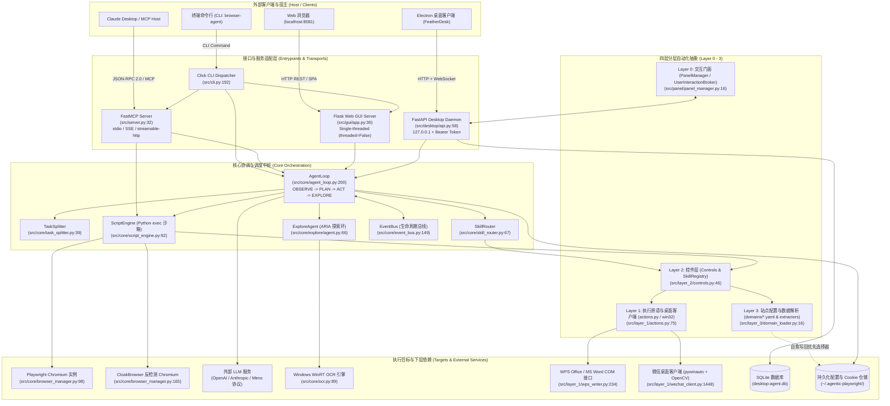
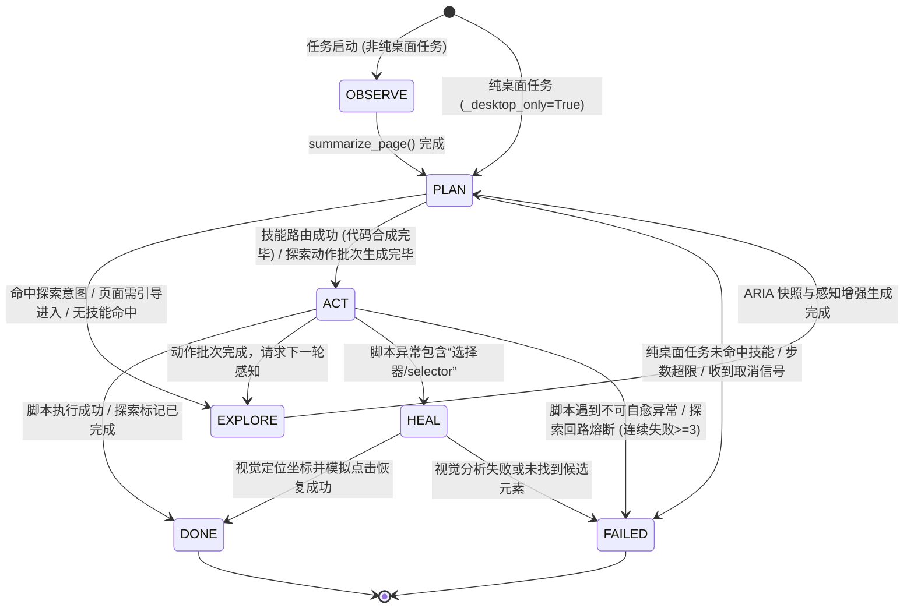
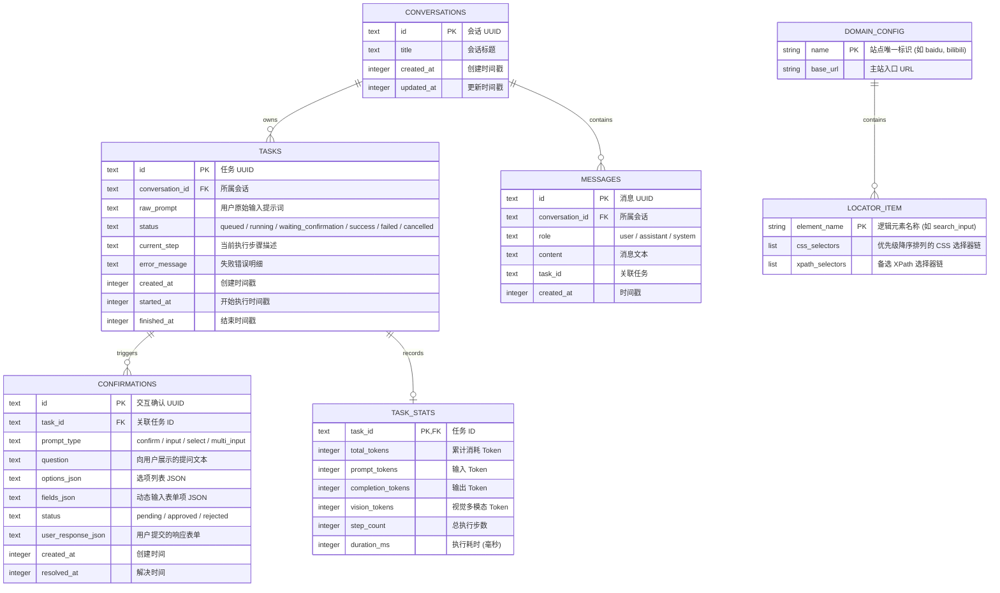
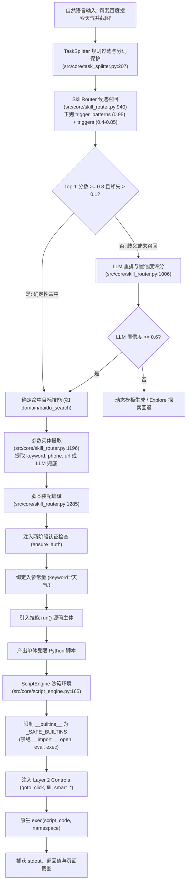
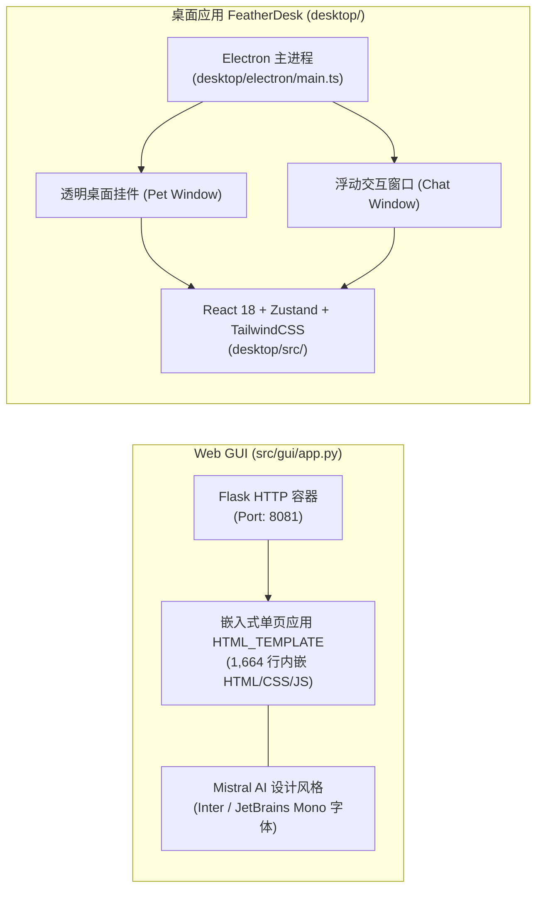
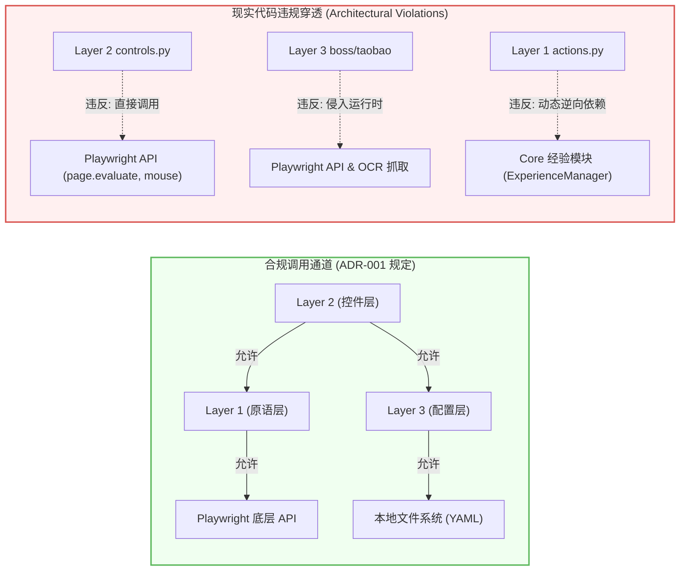

# Architecture Audit: Agentic Playwright MCP

> 本文档通过 6 个并行子系统深度审计生成，提供 `agentic-playwright-mcp` 代码库从端到端输入到执行落地的全景架构地图。全书遵循代码证据优于文档声明原则，所有架构节点与控制决策均锚定在具体的 `path:line` 代码实现，以辅助后续架构演化、模块重构与新功能扩展。
> 
> **审计基准日期**：2026-09-21  
> **代码库规模**：~106 个核心 Python 文件，包含完整 Electron + React 桌面端、Flask Web GUI、FastMCP 服务端与多平台执行引擎。

---

## 1. 系统全貌与上下文 (System Context)

`agentic-playwright-mcp` 定位为“让 AI 编写 Python 脚本控制浏览器与桌面应用的自主 Agent 框架”。系统通过 MCP (Model Context Protocol)、Web GUI、CLI 和 Electron 桌面端（FeatherDesk）接收用户自然语言意图，跨越规则路由、LLM 重排、受限 Python 沙箱执行、ARIA 语义树感知、本地 Windows OCR、多模态视觉模型以及 Win32/COM 桌面自动化等层级，最终驱动浏览器与操作系统。



---

## 2. 端到端主流程 (End-to-End Primary Flow)

AgentLoop 驱动的端到端任务执行是一个包含分流、意图路由、参数提取、沙箱执行、自愈修复和视觉多级回退的状态机。

```mermaid
flowchart TD
    Start(["用户输入自然语言任务"]) --> Init["初始化 AgentLoop 模块<br/>(src/core/agent_loop.py:261)"]
    Init --> Split["TaskSplitter 任务拆解<br/>(src/core/task_splitter.py:39)"]

    Split --> SplitCheck{"是否包含复合任务/多Tab?"}
    SplitCheck -->|多Tab独立任务| RunTabs["_run_in_new_tabs 并发/独立执行<br/>(src/core/agent_loop.py:353)"]
    SplitCheck -->|分号顺行步骤| RunSeq["_run_sequential 同Tab顺行<br/>(src/core/agent_loop.py:399)"]
    SplitCheck -->|单步直接运行| SingleRun["_run_single 单任务状态机<br/>(src/core/agent_loop.py:447)"]

    RunTabs --> SingleRun
    RunSeq --> SingleRun

    subgraph LoopStateMachine ["单任务生命周期状态机 (_run_single)"]
        CheckCancel{"是否收到取消信号?<br/>(src/core/agent_loop.py:490)"} -->|是| FailCancel["状态转为 FAILED (TaskCancelledError)"]
        CheckCancel -->|否| CheckSteps{"步数 > max_steps (默认20)?<br/>(src/core/agent_loop.py:496)"}
        CheckSteps -->|是| FailMax["状态转为 FAILED (超限中断)"]
        CheckSteps -->|否| StateCheck{"当前 AgentState"}

        StateCheck -->|OBSERVE| DoObserve["_do_observe: DOM 摘要探测<br/>(src/core/agent_loop.py:784)<br/>dom_explorer.summarize_page()"]
        DoObserve --> TransPlan["迁移至 PLAN 状态"]
        TransPlan --> StateCheck

        StateCheck -->|PLAN| DoPlan["_do_plan: 规划决策门禁<br/>(src/core/agent_loop.py:866)"]
        
        DoPlan --> GateExploreMode{"处于 Explore 模式?<br/>(src/core/agent_loop.py:930)"}
        GateExploreMode -->|是| TransExplore["迁移至 EXPLORE 状态"]
        GateExploreMode -->|否| RouteSkills["SkillRouter.route(task, page)<br/>(src/core/skill_router.py:153)"]

        RouteSkills --> RouteDecision{"路由命中结果?<br/>(src/core/skill_router.py:229)"}
        RouteDecision -->|分数 >= 0.8 / LLM重排命中| BuildScript["组装参数化 Python 脚本<br/>(src/core/skill_router.py:1178)"]
        RouteDecision -->|探索意图 / 未命中技能| FallbackBootstrap{"是否有明确网站入口?<br/>(src/core/agent_loop.py:985)"}

        FallbackBootstrap -->|是且页面为空| NavBootstrap["打开入口 URL -> 迁移至 OBSERVE<br/>(src/core/agent_loop.py:997)"]
        FallbackBootstrap -->|否 / 页面已有内容| TransExplore

        BuildScript --> TransAct["迁移至 ACT 状态"]
        TransExplore --> StateCheck
        TransAct --> StateCheck

        StateCheck -->|EXPLORE| DoExplore["_do_explore: 生成 ARIA 快照<br/>(src/core/agent_loop.py:1183)<br/>explore_agent.snapshot(step)"]
        DoExplore --> PlanNextAction["explore_agent.plan_actions()<br/>(src/core/agent_loop.py:910)"]
        PlanNextAction --> PlanStatus{"Explore 规划状态"}
        PlanStatus -->|已完成| SetDone["迁移至 DONE 状态"]
        PlanStatus -->|生成动作批次| TransAct
        PlanStatus -->|卡死/需用户输入| PromptPanel["唤起桌面确认/交互面板<br/>(src/core/agent_loop.py:2146)"]
        PromptPanel --> TransAct

        StateCheck -->|ACT| DoAct["_do_act: 执行脚本或探索动作<br/>(src/core/agent_loop.py:2037)"]
        DoAct --> ExecMode{"执行模式"}
        ExecMode -->|Explore 动作批次| ExecExplore["ExploreExecutor.execute()<br/>(src/core/explore/executor.py:210)"]
        ExecMode -->|Python 脚本| ExecScript["ScriptEngine.execute()<br/>(src/core/script_engine.py:126)"]

        ExecScript --> ScriptResultCheck{"脚本是否执行成功?"}
        ScriptResultCheck -->|成功| SetDone
        ScriptResultCheck -->|失败: 包含选择器错误| TryHeal["_try_heal 视觉自愈<br/>(src/core/agent_loop.py:2170)"]
        ScriptResultCheck -->|失败: 其他异常| SetFailed["迁移至 FAILED 状态"]

        TryHeal --> VisionInspect["VisionModule.analyze_page()<br/>(src/core/agent_loop.py:2203)"]
        VisionInspect --> HealFound{"发现匹配候选坐标/选择器?"}
        HealFound -->|是| ClickHeal["点击候选元素 / page.mouse.click(x,y)<br/>(src/core/agent_loop.py:2234)"]
        HealFound -->|否| SetFailed
        ClickHeal --> SetDone

        ExecExplore --> ExploreResultCheck{"探索动作批次结果"}
        ExploreResultCheck -->|成功| CheckTerminator{"动作批次结束标记?"}
        CheckTerminator -->|complete=True| SetDone
        CheckTerminator -->|需要更新快照| TransExplore
        ExploreResultCheck -->|失败/卡住| CircuitCheck{"连续失败 >= 3 次?"}
        CircuitCheck -->|是: 熔断| SetFailed
        CircuitCheck -->|否| TransExplore
    end

    SetDone --> ResultOutput(["汇总指标，触发 EVENT_AGENT_TASK(AFTER)，输出结果"])
    SetFailed --> ResultOutput
    FailCancel --> ResultOutput
    FailMax --> ResultOutput
```



### 关键流转阶段代码锚点：
- **任务拆解**：`src/core/task_splitter.py:39-138`，先做引号/URL保护，再按句号/分号切分。
- **状态转移总调度**：`src/core/agent_loop.py:488-568`，while 循环推进状态。
- **技能规则初筛与 LLM 重排**：`src/core/skill_router.py:153-270`，关键词分数 $\ge 0.8$ 直通，否则提取前 40 个候选进 LLM 重排。
- **沙箱编译执行**：`src/core/script_engine.py:126-190`，构建命名空间并调用原生 `exec()`。
- **视觉选择器自愈**：`src/core/agent_loop.py:2170-2255`，捕捉含有“选择器”关键字的失败，结合多模态模型定位坐标点击。

---

## 3. 核心组件名册 (Component / Service Roster)

| 组件名称 | 交付状态 | 核心职责 | 输入契约 | 输出契约 | 核心代码路径 (path:line) | 依赖模块 |
| :--- | :--- | :--- | :--- | :--- | :--- | :--- |
| **AgentLoop** | **Shipped** | 端到端自动化协调状态机，调度 OBSERVE/PLAN/ACT/EXPLORE/HEAL 状态流转 | 自然语言任务文本、配置项、取消句柄 | `AgentTaskResult` (步骤列表、耗时、Token统计、产物) | `src/core/agent_loop.py:200-599` | `TaskSplitter`, `SkillRouter`, `ScriptEngine`, `ExploreAgent`, `EventBus`, `BrowserManager` |
| **TaskSplitter** | **Shipped** | 将复杂复合任务分解为单步或并发/独立 Tab 序列 | 原始任务字符串 | `List[TaskGroup]`（包含子任务列表与 sequential 标记） | `src/core/task_splitter.py:39-138` | `re`, `src.core.llm_utils` |
| **SkillRouter** | **Shipped** | 负责技能两阶段匹配（规则初筛 + LLM 重排）、参数提取与脚本拼接 | 任务描述、页面 URL 与标题上下文 | `SkillDecision`（技能元数据、置信度、可执行 Python 脚本） | `src/core/skill_router.py:67-270` | `yaml`, `src.skill_library.skills.yaml`, `src.core.llm_client` |
| **ScriptEngine** | **Shipped** | 在受限 Python 命名空间中同步执行脚本，捕获 stdout 并包装登录拦截 | Python 源码字符串 | `ScriptResult`（执行结果、输出日志、异常堆栈、截图） | `src/core/script_engine.py:92-190` | `playwright.sync_api`, `_SAFE_BUILTINS`, `Layer 2 Controls` |
| **ScriptGenerator** | **Shipped** | 规则与模板脚本生成器，根据 `domains/*.yaml` 生成标准自动化脚本 | `task: str`, `page_summary: str` | 生成的 Python 源码字符串 | `src/core/script_generator.py:37-211` | `re`, `yaml`, `domains/*.yaml` |
| **BrowserManager** | **Shipped** | 浏览器进程与上下文单例管理器，提供反检测引擎切换与 Cookie 状态重载 | 启动配置（headless、engine、proxy）、域名 | Playwright `Page`, `BrowserContext` | `src/core/browser_manager.py:54-570` | `playwright`, `cloakbrowser`, `AuthManager` |
| **AuthManager** | **Shipped** | 站点凭证管理，按域名存储与恢复 localStorage 和 cookies | 域名、BrowserContext 或 JSON 结构 | 认证状态文件路径 (`~/.agentic-playwright/auth/*.json`) | `src/core/auth_manager.py:34-144` | `pathlib`, `json` |
| **ExploreAgent** | **Shipped** | 自主探索执行中枢，驱动基于 ARIA 快照与反思环路的目标交互 | 任务目标、步数上下文 | 运行状态标记 (`explore`, `done`, `stuck`, `failed`) | `src/core/explore/agent.py:66-400` | `SnapshotGenerator`, `VisionRouter`, `ExploreExecutor`, `ExperienceManager` |
| **SnapshotGenerator** | **Shipped** | 页面 ARIA 语义树提取器，递归计算 CSS 路径并为可交互节点打标 `data-explore-ref` | Playwright `Page`, 提取模式 | `SnapshotResponse`（节点树、可交互元素计数） | `src/core/explore/snapshot.py:392-560` | 注入脚本 `_ARIA_EXTRACTION_JS_FALLBACK` |
| **VisionRouter** | **Shipped** | 预算感知的分级感知调度器，根据页面 ARIA 质量路由至深度扫描、本地 OCR 或多模态视觉 | ARIA 快照、页面截图、任务文本 | 补充了 `o1, o2...` 与 `v1, v2...` 目标引用的增强快照 | `src/core/explore/vision_router.py:29-346` | `OcrModule`, `VisionModule`, `SurfaceStats` |
| **OcrModule** | **Shipped (Win)** | 基于 Windows WinRT `Windows.Media.Ocr` 的零 Token 本地屏幕文字定位 | 截图 PNG 字节流、视口宽高 | 归一化坐标词框列表 (`OcrResult`) | `src/core/ocr.py:89-214` | `winrt.windows.media.ocr` |
| **ExploreExecutor** | **Shipped** | 探索动作原子执行器，校验引用新鲜度、坐标偏移并防御敏感操作 | `ActionBatch`, 当前快照, `Page` | `ExecutionResult` | `src/core/explore/executor.py:89-400` | Playwright API, 坐标换算逻辑 |
| **GenericLoginGuard** | **Shipped (Script)** | 检测页面登录弹窗与验证码，通过交互面板阻塞等待人工登录并保存凭据 | `Page`, 动作名称 | 登录完成确认或超时异常 | `src/core/login_guard.py:11-360` | Injected JS, `UserInteractionBroker`, `AuthManager` |
| **Layer 0 PanelManager** | **Shipped (Facade)** | 兼容面板操作的桥接门面，向底层交互经纪人发送日志与提问 | 提问文本、结构化表单、日志字符串 | 用户输入字符串、事件队列 | `src/panel/panel_manager.py:16-65` | `src.core.user_interaction.UserInteractionBroker` |
| **Layer 1 Actions** | **Shipped** | 浏览器原子操作，封装候选选择器链逐个探测、可见性等待与失败截图 | `Page`, `selector_list`, 超时时间 | 操作状态字典（成功标志、胜出选择器索引） | `src/layer_1/actions.py:75-342` | Playwright `sync_api`, `EventBus`, `ExperienceManager` |
| **Layer 1 WeChat** | **Shipped** | 微信 Windows 客户端本地原生自动化（发消息、发文件、点赞朋友圈、关注） | 联系人、文件路径、公众号名称 | 执行结果字典 | `src/layer_1/wechat_client.py:1-3766` | `pywinauto`, Win32 API (`user32`), OpenCV 图像匹配 |
| **Layer 1 WPS Writer** | **Shipped** | 金山 WPS / 微软 Word COM 原生接口驱动，支持文档排版、表格插入与导出 PDF | 文档路径、Markdown 文本、样式参数 | 生成的文档路径字典 | `src/layer_1/wps_writer.py:1-1210` | Windows COM (`KWPS.Application`, `Word.Application`) |
| **Layer 2 Controls** | **Shipped** | 注入脚本沙箱的领域控制函数门面 (`smart_click`, `smart_fill`, `smart_search`) | 元素逻辑名、域名、文本参数 | 控制函数执行结果字典 | `src/layer_2/controls.py:46-976` | `src.layer_1.actions`, `src.layer_3.domain_loader` |
| **Layer 3 DomainLoader** | **Shipped** | 加载并校验 `domains/*.yaml`，解析 CSS 与 XPath 选择器列表 | 站点域名字符串 | `DomainConfig` Pydantic 对象 | `src/layer_3/domain_loader.py:16-97` | `pydantic`, `pyyaml`, `domains/*.yaml` |
| **Layer 3 ConfigUpdater** | **Shipped** | 自愈配置写回器：当备选选择器胜出时，自动将其提升至 YAML 首位 | 域名、元素名、成功的选择器 | 写入成功状态布尔值 | `src/layer_3/config_updater.py:26-92` | `pyyaml`, `os` |
| **FastMCP Server** | **Shipped** | 实现 Model Context Protocol，向外部开放 18 个标准工具 | JSON-RPC 2.0 请求（stdio/SSE） | 格式化文本与 JSON 响应 | `src/server.py:32-636` | `mcp.server.fastmcp.FastMCP`, `AgentLoop`, `ScriptEngine` |
| **Desktop TaskService** | **Shipped** | 桌面端任务单线程调度服务，管理任务队列与人机交互确认状态机 | 任务描述文本、取消请求、用户确认审批 | 任务状态变更、WebSocket 进度推送 | `src/desktop/task_service.py:119-482` | `ThreadPoolExecutor(max_workers=1)`, `AgentLoop`, `SQLite` |
| **EventBus** | **Shipped** | 进程级按优先级排序的同步生命周期事件分发器 | 事件名称、生命周期阶段 (`BEFORE`/`AFTER`)、数据上下文 | 携带拦截状态与执行耗时的事件对象 | `src/core/event_bus.py:149-350` | `src.logging` |
| **TokenTracker** | **Shipped** | 线程安全的多模态 Token 统计器，隔离文本与视觉消耗并按步骤打快照 | Token 使用增量 (`TokenUsage`) | 结构化用量明细与账单估算 | `src/core/token_tracker.py:99-174` | 内部原子计数器 |
| **RecoveryManager** | **Parked** | 独立异常分析器，提供弹窗消除、等待重试、刷新等确定性恢复策略 | Playwright 异常实例、错误上下文 | 建议的恢复动作 (`RecoveryAction`) | `src/core/recovery.py:44-227` | `playwright.sync_api.TimeoutError` |
| **ScriptStore** | **Parked** | 基于磁盘文件的脚本持久化与成功率统计仓储（仅 SDK 和 GUI 部分调用） | 任务文本、脚本代码、标签 | 磁盘 `.py` 文件及 `scripts/index.json` | `src/core/script_store.py:47-210` | `hashlib`, `json` |
| **SkillBase (OOP)** | **Parked** | 面向对象的技能抽象基类，定义生命周期方法（setup/execute/teardown） | `Page`, 参数字典 | `SkillResult` | `src/skill_library/skill_base.py:81` | 仅单元测试使用，生产技能均为脚本过程 |
| **SkillYamlRegistry** | **Parked** | 声明式 YAML 技能语法解析器，解析 `skills/**/*.yaml` 的多步执行模型 | `skills/` 目录下的 YAML 技能规范 | `SkillConfig` 模型实例 | `src/layer_2/skill_loader.py:77` | 生产链路未接入，仅测试引用 |

### 核心组件协作时序 (Sequence Diagram)

```mermaid
sequenceDiagram
    autonumber
    actor User as 用户 / 外部客户端
    participant Server as MCP/Desktop API
    participant Loop as AgentLoop
    participant Router as SkillRouter
    participant Engine as ScriptEngine
    participant Controls as Layer 2 Controls
    participant Actions as Layer 1 Actions
    participant Loader as Layer 3 DomainLoader
    participant Page as Playwright Page
    participant Updater as Layer 3 ConfigUpdater

    User->>Server: 提交任务 ("在百度搜索 Python 教程")
    Server->>Loop: run(task)
    Loop->>Loop: _do_observe() -> 获取初始页面摘要
    Loop->>Router: route(task, page_context)
    Router->>Router: 触发规则快筛 (正则 patterns + triggers)
    Router->>Router: 参数提取 (keyword="Python 教程")
    Router->>Router: 读取模板并组装可执行脚本
    Router-->>Loop: 返回 SkillDecision (包含合成脚本)
    Loop->>Engine: execute(script_code)
    
    rect rgb(240, 245, 255)
        note over Engine, Actions: 沙箱脚本内部执行流
        Engine->>Controls: smart_search("baidu", "Python 教程")
        Controls->>Loader: load_domain("baidu")
        Loader-->>Controls: 返回 DomainConfig
        Controls->>Loader: get_element_selectors("search_input")
        Loader-->>Controls: 返回候选链 ["#kw", "input[name='wd']", ".s_ipt"]
        Controls->>Actions: do_fill(page, selectors, "Python 教程")
        
        loop 遍历备选选择器
            Actions->>Page: is_visible(sel[0]) -> 超时失败
            Actions->>Page: is_visible(sel[1]) -> 成功可见
            Actions->>Page: fill(sel[1], "Python 教程")
        end
        Actions-->>Controls: {"success": True, "used_selector": "input[name='wd']", "index": 1}
        
        opt 发现备用选择器胜出 (index > 0)
            Controls->>Updater: update_selector_priority("baidu", "search_input", "input[name='wd']")
            Updater->>Updater: 将胜出选择器提升为 YAML 首项并写回磁盘
        end
        
        Controls->>Actions: do_click(page, submit_selectors)
        Actions->>Page: click("#su")
        Actions-->>Controls: {"success": True, "index": 0}
    end

    Engine-->>Loop: ScriptResult(success=True)
    Loop-->>Server: AgentTaskResult(status="DONE", tokens, steps)
    Server-->>User: 返回执行成功响应
```

---

## 4. 数据生命周期与状态模型 (Data Lifecycle)

### A. 任务执行状态机 (Task State Machine)
系统中最核心的实体是自动化任务（Task）。在 `src/core/agent_loop.py:108` 中定义了 6 个明确的核心执行状态：



### B. 实体关系图 (Entity-Relationship Diagram)
系统的数据持久化主要由两部分构成：
1. **桌面服务 SQLite 数据库** (`src/desktop/database.py:38-103`)：管理多会话、任务队列、人机交互确认与统计指标。
2. **Layer 3 声明式站点配置** (`domains/*.yaml`，由 `src/layer_3/domain_loader.py` 定义)。



---

## 5. 核心业务转换 (Core Transform: 意图编译与沙箱执行)

本系统存在的终极业务目标是：**将不可预测的自然语言意图，转化为受控、抗反爬、自愈的确定性自动化执行**。



---

## 6. 外部系统集成与协议发布 (Integrations & Publishing)

系统通过四种主要协议通道与外部世界通信：

### 1. Model Context Protocol (MCP) 接口映射表 (`src/server.py`)
对外发布为基于 FastMCP 的标准 MCP 2.0 工具集合：

| MCP 工具名 | 对应底层调用 | 外部入参结构 | 数据处理与转换逻辑 |
| :--- | :--- | :--- | :--- |
| `run_task` | `AgentLoop.run(task)` | `task: str`, `max_steps: int = 20` | 驱动多步骤闭环 Agent，统计返回步骤细节与 Token 消耗格式化字符串 |
| `run_script` | `ScriptEngine.execute(code)` | `code: str` | 在注入 Layer 2 控制函数的受限命名空间中同步执行 Python 脚本 |
| `analyze_page` | `VisionModule.analyze_page()` | `prompt: str` | 捕获当前视口图片 Base64 编码，调用视觉模型解析可交互元素与坐标 |
| `browse_skills` | `SkillRegistry.search()` | `query: str = ""`, `url: str = ""` | 检索可用自动化技能，返回技能元数据列表 |
| `get_skill` | `SkillRegistry.get()` | `skill_id: str` | 读取技能 Python 源码与 YAML 定义指南文本 |
| `browser_launch` | `BrowserManager.launch()` | `headless: bool`, `use_cloak: bool` | 启动 Chromium / CloakBrowser 反检测进程 |
| `auth_list` | `AuthManager.list_auth()` | 无 | 列出当前 `~/.agentic-playwright/auth/` 下保存的所有站点凭据 |
| `auth_save` | `AuthManager.save_auth()` | `domain: str` | 导出当前 BrowserContext 的 Cookies 与 localStorage 到本地 JSON |
| `panel_prompt` | `UserInteractionBroker.prompt()` | `question: str`, `title: str = ""` | 向前端交互面板推送阻塞式提问，挂起等待用户在 UI 中输入应答 |

### 2. Electron 桌面端 IPC 与 WebSocket 契约
- **进程启动**：Electron 主进程分配未占用端口，随机生成 64 位 Hex Token (`DESKTOP_AGENT_TOKEN`)，拉起子进程 `python -m src.desktop.api --host 127.0.0.1 --port <port>`。
- **IPC 桥梁**：Preload 脚本通过 `contextBridge` 开放 `getBackendConfig()`，使 React 渲染进程获取本地端口与鉴权 Token。
- **REST 鉴权**：请求头附带 `Authorization: Bearer <token>`，由 FastAPI 依赖项统一校验。
- **WebSocket 实时流**：通过 `ws://127.0.0.1:<port>/api/events?token=<token>` 建立持久连接，`DesktopEventHub` 将后端单线程工作者的步骤推进、Token 用量与确认弹窗广播至前端。

### 3. 本地操作系统级集成
- **Windows COM 接口**：`src/layer_1/wps_writer.py:234` 借助 `win32com.client.DispatchEx` 直接调用 `KWPS.Application` 或 `Word.Application`，操作本地文档排版与 PDF 转换。
- **Win32 API & UI Automation**：`src/layer_1/wechat_client.py:1448` 借助 `pywinauto` 与 `user32.dll` 控制微信 Windows 客户端进行消息分发。
- **Windows WinRT 本地 OCR**：`src/core/ocr.py:89` 借助 `winrt.windows.media.ocr` 消费视口位图，实现本地零成本文字定位。

---

## 7. 前端与交互呈现 (Frontend & Presentation)

系统包含两套完全独立的前端呈现形态：



1. **Web GUI (`src/gui/app.py`)**：
   - 采用单文件内联架构，全量前端代码直接以 `HTML_TEMPLATE` 巨型常量（第 323 至 1987 行）写入 Python 文件，免构建直接提供服务。
   - 视觉体系严格继承 Mistral AI 风格指南，使用 `#FA520F`（Mistral 橙）作为品牌主色，适配深色暗黑主题。
   - 依赖项采用无包管理器 CDN 载入：Tailwind CSS、Lucide 图标库、Google 字体。
2. **桌面工作空间 FeatherDesk (`desktop/`)**：
   - 现代 TypeScript + React + Vite 构建管线。
   - 双窗口模型：
     - **桌宠挂件窗口 (`petWindow`)**：无边框、支持鼠标穿透与拖拽，渲染动态状态表情。
     - **交互控制窗口 (`chatWindow`)**：支持任务输入、步骤折叠查看、Token 仪表盘与人工确认表单。

---

## 8. 调度控制与安全门禁 (Orchestration & Guards)

系统的调度控制由一系列硬性数字指标与安全屏障守护：

| 门禁类型 | 控制参数 / 阈值 | 强制级别 | 代码实现位置 | 触发后果与处理策略 |
| :--- | :--- | :--- | :--- | :--- |
| **单任务最大步数** | `max_steps = 20` (AgentLoop)<br/>`max_steps = 10` (SDK) | 机械硬中断 | `src/core/agent_loop.py:497`<br>`src/sdk.py:43` | 中断当前状态机循环，直接将任务标记为 `AgentState.FAILED` |
| **网络请求超时** | `timeout = 30.0s` | 协议硬中断 | `src/core/llm_client.py:60,78` | 抛出 HTTP 超时异常，由外层捕获并转为失败响应 |
| **LLM JSON 修复重试**| `max_retries = 1` | 弹性回退 | `src/core/llm_utils.py:13-45` | JSON 格式错误时触发单次针对性修复 Prompt，失败则弃用结构化结果 |
| **登录检测频率防抖**| `guard_interval = 0.5s` | 性能防抖 | `src/core/login_guard.py:48` | 500ms 内跳过重复登录弹窗检测，防止密集操作引起页面性能崩塌 |
| **人工登录等待超时**| `AUTO_LOGIN_WAIT = 300s` | 人工介入硬中断 | `src/core/login_guard.py:484` | 阻塞等待人工登录扫码，超 5 分钟抛出 `RuntimeError` |
| **单任务视觉调用预算**| `max_calls_per_task = 5` | 费用硬上限 | `src/core/explore/vision_router.py:326` | 抛出 `VisionBudgetExceeded`，拒绝生成视觉 Token，回退至交互请求 |
| **同页视觉调用预算**| `max_calls_per_page = 2` | 循环硬上限 | `src/core/explore/vision_router.py:328` | 同一视口状态下最多调用 2 次视觉模型，防范感知幻觉死循环 |
| **截图大小限制** | `max_bytes = 4MB` | 资源硬上限 | `src/core/explore/vision_router.py:124` | 视口截图超过 4,000,000 字节直接丢弃，不向多模态 API 发送 |
| **视觉目标置信门槛**| `min_confidence = 0.65` | 安全阻断 | `src/core/explore/executor.py:636` | 视觉模型识别出的元素置信度低于 0.65 时直接过滤，不执行点击 |
| **敏感操作防范** | 支付、下单、删除、转账等关键词 | 安全硬阻断 | `src/core/explore/executor.py:640` | 禁止通过多模态坐标或 OCR 点击涉及资金或删除的敏感按钮 |
| **视口偏移与漂移校验**| URL 变化或滚动偏移 > 2px | 状态保真门禁 | `src/core/explore/executor.py:700` | 抛出 `SnapshotStaleError`，拒绝点击过期的视觉相对坐标，强制刷新快照 |
| **探索连续失败熔断**| `consecutive_failures >= 3` | 容错熔断 | `src/core/explore/agent.py:272` | 连续 3 次操作同一类型节点失败后触发熔断，挂起任务等待人工输入 |
| **沙箱内置禁用列表**| 禁除 `__import__`, `open`, `eval` 等 | 语言级隔离 | `src/core/script_engine.py:48-84` | 脚本内尝试导包或系统调用触发 `ImportError` 或 `NameError` |

---

## 9. 架构契约与治理规则 (Governance & Rules)

系统设计遵循严格的依赖边界与设计决策，但历史迭代中部分原则遭到了代码侵蚀。



### 核心不可违背法则 (The Repo's MUSTs & NEVER-DOs)
1. **必须保证 Playwright 单线程执行 (MUST)**：
   由于 Playwright Python 采用同步事件循环 (`sync_api`)，跨线程操作 Page 会引发死锁或异常。因此 Flask Web GUI 必须设置 `threaded=False` (`src/gui/app.py:2411`)，Desktop 服务必须采用 `max_workers=1` 的单工作线程 (`src/desktop/task_service.py:253`)。
2. **严禁在生产执行中直接调用 `ast.parse` 之外的不可信代码执行方式 (MUST)**：
   执行动态生成的代码必须由 `ScriptEngine` 提供干净的命名空间 (`{"__builtins__": _SAFE_BUILTINS}`)，禁止在主进程中直接运行 `eval()`。
3. **备用选择器命中必须自愈回写 (MUST)**：
   当多层备选 CSS/XPath 中非首位的选择器命中时，系统必须调用 `config_updater.update_selector_priority` 将其持久化回写至 YAML 文件的首项，实现“越用越快”。
4. **禁止通过 DOM 注入影响宿主页面样式与行为 (REVISED RULE)**：
   早期的 Shadow DOM 面板已被弃用，人机交互必须全部通过 `UserInteractionBroker` 转发至进程外桌面 UI 处理，严禁直接污染被控网页的 DOM。

---

## 10. “我要修改 X 应该改哪里” 速查表 (Cheatsheet)

本表映射日常维护与新特性扩展时最常见的修改意图到具体的代码文件：

| 修改意图 (Intent) | 责任模块与文件路径 | 核心关注行号 / 函数 |
| :--- | :--- | :--- |
| **新增一个网站的适配配置 (如 JD, PDD)** | `domains/<site>.yaml` | 参照 `domains/baidu.yaml` 声明 `base_url` 与 `locators` 的 CSS/XPath 数组 |
| **调整某个已有站点的元素选择器** | `domains/<site>.yaml` | 在对应键名下新增或调整 CSS/XPath 选择器字符串 |
| **修改默认大模型提供商或 API 密钥解析** | `src/config.py`<br>`src/config_manager.py` | `src/config.py:28-57` (`_DEFAULTS`)<br>`src/config_manager.py:16` (`DEFAULT_CONFIG`) |
| **优化或新增一条常用技能 (如新增小红书收藏)** | `src/skill_library/` 对应分类目录<br>`src/skill_library/skills.yaml` | 1. 在 `src/skill_library/` 新建 Python 文件并暴露 `def run(...)`<br>2. 在 `skills.yaml` 登记触发词与参数规则 |
| **调整技能两阶段路由与重排决策阈值** | `src/core/skill_router.py` | `src/core/skill_router.py:229-265` (置信度门限与分流逻辑) |
| **修改执行沙箱允许调用的 Python 函数库** | `src/core/script_engine.py`<br>`src/layer_2/controls.py` | `src/core/script_engine.py:48-84` (`_SAFE_BUILTINS`)<br>`src/layer_2/controls.py:978-1026` (`get_controls_exports`) |
| **修改浏览器启动参数 (如开启无头模式、代理)** | `src/core/browser_manager.py` | `src/core/browser_manager.py:98-229` (`launch` 与 `launch_with_domain`) |
| **调整多模态视觉感知的调用预算与触发阈值** | `src/core/explore/models.py`<br>`src/core/explore/vision_router.py` | `src/core/explore/models.py:304-316`<br>`src/core/explore/vision_router.py:320-340` |
| **修改 MCP 对外暴露的工具接口 (新增/变更工具)**| `src/server.py` | `src/server.py:62-622` (用 `@mcp.tool()` 装饰的函数定义) |
| **修改桌面端 (Electron) 窗口外观与悬浮窗行为** | `desktop/electron/main.ts`<br>`desktop/src/App.tsx` | `desktop/electron/main.ts:43-150` (窗口尺寸、透明度、置顶属性) |
| **修改桌面端与 Python 后端的通信协议** | `src/desktop/api.py`<br>`desktop/src/services/api.ts` | `src/desktop/api.py:93-270` (FastAPI 路由)<br>`desktop/src/services/api.ts:1-47` |
| **增加对新桌面办公软件的原生自动化支持** | `src/layer_1/` | 新增类似 `wps_writer.py` (COM 操作) 或 `wechat_client.py` (Win32/UIAutomation) |
| **修改 Web GUI 的前端界面与功能按钮** | `src/gui/app.py` | `src/gui/app.py:323-1987` (`HTML_TEMPLATE` 巨型常量) |

---

## 11. 观察发现与决策输入 (Observations & Decision Input)

本次全景审计深入代码实现，揭示了多个实际代码与官方文档冲突的重要事实，作为后续版本迭代与重构的关键决策依据：

### 1. 现状盘点：已实现 vs 闲置/伪装代码 (Shipped vs Parked)
- **`inject.js` 彻底消失**：`README.md` 大幅宣称的 Layer 0 浏览器内 Shadow DOM 交互面板，其前端文件 `src/panel/inject.js` 在代码仓库中并不存在。`PanelManager` 目前已完全退化为将提问转发给桌面端 `UserInteractionBroker` 的非 DOM 门面。
- **面向对象 `SkillBase` 属于闲置死代码**：虽然 `src/skill_library/skill_base.py` 提供了完善的 OOP 抽象，但所有生产技能（40 个）全部写为面向过程的纯函数，`SkillRegistry.get_instance()` 对生产技能永远返回 `None`。
- **根目录 `skills/*.yaml` 声明式系统未接入主流程**：根目录下 20 个声明式技能 YAML 及 `skill_loader.py` 仅供测试使用，`AgentLoop` 运行时完全通过 `src/skill_library/skills.yaml` 读取和拼装 Python 代码。
- **`RecoveryManager` 属于游离代码**：`src/core/recovery.py` 中的基于异常类型的启发式恢复逻辑从未被 `AgentLoop` 导入，主流程中遇到选择器失败直接由视觉 `_try_heal` 接管。

### 2. 代码矛盾与文档过时点 (Contradictions & Stale Docs)
- **ADR-003 与实际状态机拓扑严重脱节**：`docs/adr/003-agent-loop-design.md` 描述了一个包含 10 个异步状态的状态机，而代码实现中 `AgentLoop` 是一个彻底同步的 6 状态有限状态机（OBSERVE、PLAN、ACT、EXPLORE、DONE、FAILED）。
- **ADR-002 宣称的安全校验未落地**：`docs/adr/002-sandboxed-script-engine.md` 声称会对代码进行 AST 静态遍历检测，封禁私有变量访问与超时中断。但现实中 `ScriptEngine` 没有 AST 校验，也没有基于 signal 的超时控制（且 `SIGALRM` 在 Windows 下根本不可用），其安全性仅依赖内置白名单排除了 `__import__`。
- **CloakBrowser 默认开关文档与代码颠倒**：`src/core/browser_manager.py` 的函数注释声称 `USE_CLOAKBROWSER` 默认值为 `false`，但实际代码 `os.getenv("USE_CLOAKBROWSER", "true")` 以及配置默认值均为 `true`。
- **环境变量覆盖优先级 Bug**：`src/cli.py:180` 注释标明 `.env` 优先级高于 `config.yaml`，但在代码中却先调用 `config.apply_to_env()` 占位了系统环境变量，导致随后的 `load_dotenv(override=False)` 根本无法用 `.env` 覆盖对应配置。

### 3. 打开的设计问题 (Open Questions for Next Actions)
1. **是否正式废除 `SkillBase` 与声明式 `skills/*.yaml`？**
   建议清理这两套冗余设计，确立“以 `skills.yaml` 为元数据登记册，以原生 Python 函数为执行体”的唯一实现路线。
2. **是否重构 Layer 1/2/3 的层次边界？**
   `Layer 1` 内部塞入了数千行微信与 WPS 桌面代码，`Layer 2` 严重穿透调用 Playwright 原生方法，`Layer 3` 混入了主动网络抓取与 OCR 逻辑。建议明确将浏览器 Web 栈与 Windows 桌面栈解耦。
3. **修复配置加载顺序与环境声明**：
   调整 `src/cli.py` 中的加载时序，并在 `src/core/browser_manager.py` 中更新过时的注释声明。
