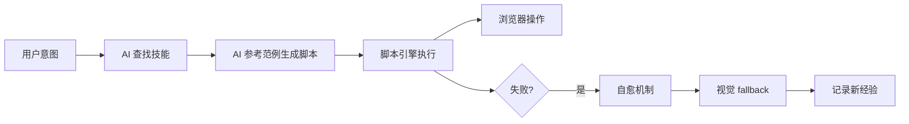

# Agentic Playwright MCP

让 AI Agent 写 Python 脚本来控制浏览器的 MCP Server 框架。

基于 Playwright，支持可选的 [CloakBrowser](https://github.com/CloakHQ/CloakBrowser) 反检测引擎。

---

## 核心理念

**AI 不是逐个调用工具，而是编写 Python 脚本。**



## 框架能力

| 模块 | 说明 | 状态 |
|------|------|------|
| **Agent 循环** | OBSERVE→PLAN→ACT 自主执行 | :material-check: |
| **脚本引擎** | 受限沙箱执行 AI 生成的 Python 脚本 | :material-check: |
| **脚本生成器** | 智能任务意图解析，支持 10+ 种任务类型 | :material-check: |
| **控件层** | `smart_login`, `smart_search` 等 15 个高级函数 | :material-check: |
| **技能库** | 16 个技能（12 站点 + 4 通用模板） | :material-check: |
| **视觉模块** | 截图 + 多模态 LLM 理解页面 | :material-check: |
| **自愈机制** | 选择器自动降级 + 优先级提升 | :material-check: |
| **错误恢复** | 弹窗处理、超时重试、页面刷新 | :material-check: |
| **脚本持久化** | 保存/加载/搜索脚本，记录使用统计 | :material-check: |
| **事件钩子** | EventBus + 7 种标准事件 | :material-check: |
| **插件系统** | SkillBase 抽象类 + skills.yaml 声明式配置 | :material-check: |
| **Web GUI** | 浏览器可视化操作界面 | :material-check: |
| **Python SDK** | `from src.sdk import AgentLoop` | :material-check: |
| **CLI** | `browser-agent serve/run/doctor/gui` | :material-check: |
| **CloakBrowser** | 反检测浏览器引擎集成 | :material-check: |

## 快速开始

```bash
# 安装
git clone https://github.com/zceeeeee/agentic-playwright-mcp.git
cd agentic-playwright-mcp
pip install -e .
playwright install chromium

# 启动 GUI
browser-agent gui --port 8081
```

## 使用方式

### Web GUI

```bash
browser-agent gui --port 8081
```

打开浏览器访问 http://localhost:8081

### CLI

```bash
browser-agent serve                                    # MCP 服务
browser-agent run "帮我在百度搜索 Python 教程"          # 单次执行
browser-agent doctor                                   # 检查环境
```

### Python SDK

```python
from src.sdk import AgentLoop

with AgentLoop(headless=True) as agent:
    result = agent.run("帮我在百度搜索 Python 教程")
    print(result.output)
```

### MCP（Claude Desktop）

```json
{
  "mcpServers": {
    "browser": {
      "command": "browser-agent",
      "args": ["serve"]
    }
  }
}
```

## MCP 工具列表

| 工具 | 说明 |
|------|------|
| `run_task` | 自然语言驱动的自主 Agent 循环 |
| `browse_skills` | 按关键词或 URL 查找技能库 |
| `get_skill` | 获取技能源码和说明文档 |
| `run_script` | 在受限沙箱中执行 Python 脚本 |
| `analyze_page` | 截图 + 多模态 LLM 分析页面 |
| `browser_launch` | 启动 Chromium 浏览器 |
| `screenshot` | 截取当前页面截图 |
| `ping` | 健康检查 |

## 已适配站点

| 站点 | 任务类型 |
|------|---------|
| 百度搜索 | 搜索关键词 |
| Google 搜索 | 搜索关键词 |
| Bing 搜索 | 搜索关键词 |
| GitHub 登录 | 登录账号 |
| GitHub 搜索 | 搜索仓库/代码 |
| GitHub 仓库 | 查看仓库列表 |
| Amazon | 搜索商品 |
| Gmail | 查看收件箱 |
| Outlook | 查看收件箱 |
| YouTube | 搜索视频 |
| 微博 | 搜索 |
| 知乎 | 搜索 |

## 文档导航

- [团队介绍](team-intro.md) — 项目概览 + 协作指南
- [快速开始](quickstart.md) — 5 分钟上手
- [架构概览](architecture.md) — 系统分层设计
- [技能库](skills.md) — 如何创建自定义技能
- [API 参考](api.md) — MCP 工具文档
- [架构决策](adr/index.md) — 设计决策记录

## 统计

| 指标 | 数值 |
|------|------|
| Python 源文件 | 46 个 |
| 测试文件 | 22 个 |
| 测试用例 | 558 个，全部通过 |
| MCP 工具 | 8 个 |
| CLI 命令 | 4 个 |
| 技能库 | 16 个（12 站点 + 4 模板） |
| 控件函数 | 15 个 |
